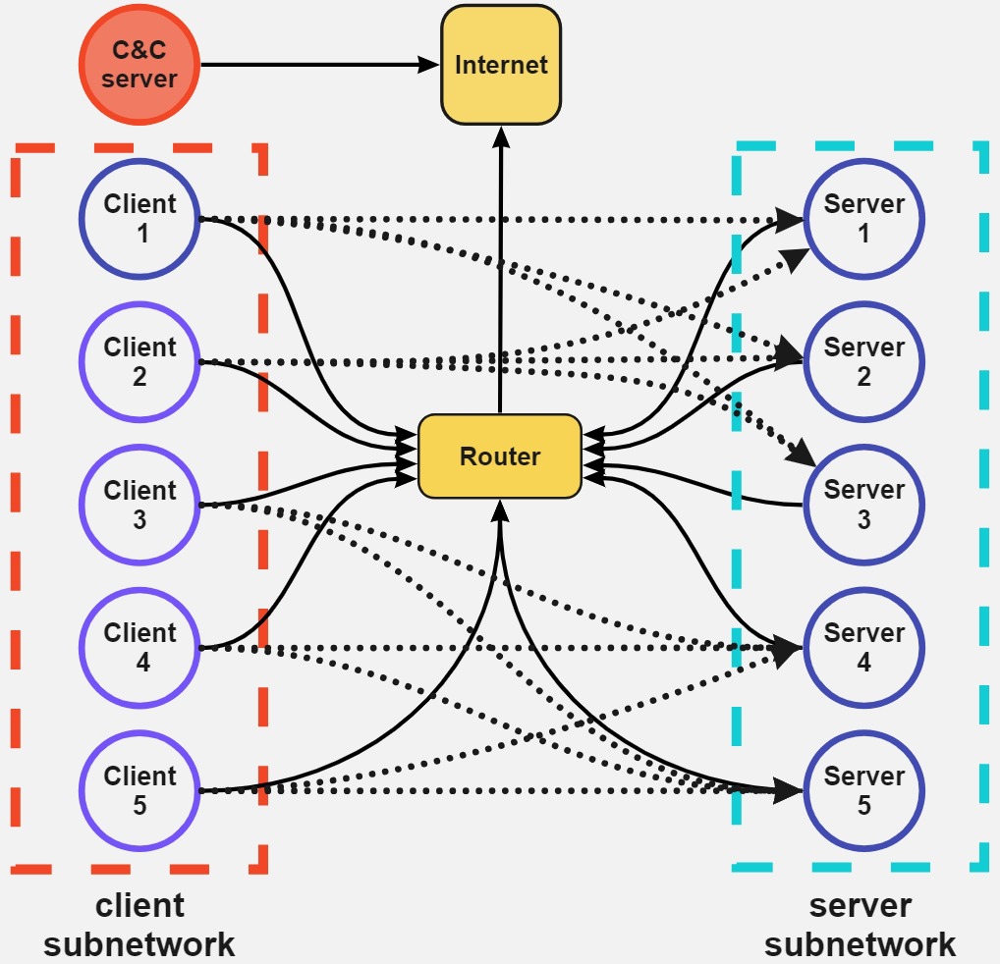

# Netwrok Security Game
[](https://github.com/stratosphereips/game-states-maker/actions/workflows/python-checks.yml)
[](https://github.com/stratosphereips/game-states-maker/actions/workflows/autotag.yml)
[](https://stratosphereips.github.io/NetSecGame/)


The NetSecGame (Network Security Game) is a framework for training and evaluation of AI agents in the network security tasks (both offensive and defensive). It is build with [CYST](https://pypi.org/project/cyst/) network simulator and enables rapid development and testing of AI agents in highly configurable scenarios. Examples of implemented agents can be seen in the submodule [NetSecGameAgents](https://github.com/stratosphereips/NetSecGameAgents/tree/main).

## Installation Guide
It is recommended to install the NetSecGame in a virual environement:
### Python venv
1. 
```bash
python -m venv <venv-name>
```
2. 
```bash
source <venv-name>/bin/activate
```

### Conda
1. 
```bash
conda create --name aidojo python==3.12
```
2. 
```bash
conda activate aidojo
```

After the virtual environment is activated, install using pip:
```bash
pip install -e .
```
### With Docker
The NetSecGame can be run in a Docker container. You can build the image locally with:
```bash 
docker build -t aidojo-nsg-coordinator:latest .
```
or use the availabe image from [Dockerhub](https://hub.docker.com/r/lukasond/aidojo-coordinator).
```bash
docker pull lukasond/aidojo-coordinator:1.0.2
```
## Quick Start
A task configuration needs to be specified to start the NetSecGame (see [Configuration](configuration.md)). For the first step, the example task configuration is recommended:
```yaml
# Example of the task configuration for NetSecGame
# The objective of the Attacker in this task is to locate specific data
# and exfiltrate it to a remote C&C server.
# The scenario starts AFTER initial breach of the local network
# (the attacker controls 1 local device + the remote C&C server).

coordinator:
  agents:
    Attacker: # Configuration of 'Attacker' agents
      max_steps: 25
      goal:
        description: "Exfiltrate data from Samba server to remote C&C server."
        is_any_part_of_goal_random: True
        known_networks: []
        known_hosts: []
        controlled_hosts: []
        known_services: {}
        known_data: {213.47.23.195: [[User1,DataFromServer1]]} # winning condition
        known_blocks: {}
      start_position: # Defined starting position of the attacker
        known_networks: []
        known_hosts: []
        controlled_hosts: [213.47.23.195, random] #
        known_services: {}
        known_data: {}
        known_blocks: {}

    Defender:
      goal:
        description: "Block all attackers"
        is_any_part_of_goal_random: False
        known_networks: []
        known_hosts: []
        controlled_hosts: []
        known_services: {}
        known_data: {}
        known_blocks: {213.47.23.195: 'all_attackers'}

      start_position:
        known_networks: []
        known_hosts: []
        controlled_hosts: []
        known_services: {}
        known_data: {}
        blocked_ips: {}
        known_blocks: {}

env:
  scenario: 'two_networks_tiny' # use the smallest topology for this example
  use_global_defender: False # Do not use global SIEM Defender
  use_dynamic_addresses: False # Do not randomize IP addresses
  use_firewall: True # Use firewall
  save_trajectories: False # Do not store trajectories
  required_players: 1
  rewards: # Configurable reward function
    success: 100
    step: -1
    fail: -10
    false_positive: -5 
```

The game can be started with:
```bash
python3 -m AIDojoCoordinator.worlds.NSEGameCoordinator \
  --task_config=./examples/example_config.yaml \
  --game_port=9000
```
Upon which the game server is created on `localhost:9000` to which the agents can connect to interact in the NetSecGame.
### Docker Container
When running in the Docker container, the NetSecGame can be started with:
```bash
docker run -it --rm \
  -v $(pwd)/examples/example_config.yaml:/aidojo/netsecenv_conf.yaml \
  -v $(pwd)/logs:/aidojo/logs \
  -p 9000:9000 lukasond/aidojo-coordinator:1.0.2
```
## Documentation
You can find user documentation at [https://stratosphereips.github.io/NetSecGame/](https://stratosphereips.github.io/NetSecGame/)
## Components of the NetSecGame Environment
The architecture of the environment can be seen [here](docs/Architecture.md).
The NetSecGame environment has several components in the following files:
```
├── AIDojoGameCoordinator/
|   ├── game_coordinator.py
|	├── game_components.py
|	├── global_defender.py
|	├── worlds/
|		├── NSGCoordinator.py
|		├── NSGRealWorldCoordinator.py
|		├── CYSTCoordinator.py
|	├── scenarios/
|		├── tiny_scenario_configuration.py
|		├── smaller_scenario_configuration.py
|		├── scenario_configuration.py
|		├── three_net_configuration.py
|	├── utils/
|		├── utils.py
|		├── log_parser.py
|		├── gamaplay_graphs.py
|		├── actions_parser.py
```


### Directory Details
- `coordinator.py`: Basic coordinator class. Handles agent communication and coordination. **Does not implement dynamics of the world** and must be extended (see examples in `worlds/`).
- `game_components.py`: Implements a library with objects used in the environment. See [detailed explanation](AIDojoCoordinator/docs/Components.md) of the game components.
- `global_defender.py`: Implements global (omnipresent) defender which can be used to stop agents. Simulation of SIEM.

#### **`worlds/`**
Modules for different world configurations:
- `NSGCoordinator.py`: Coordinator for the Network Security Game.
- `NSGRealWorldCoordinator.py`: Real-world NSG coordinator (actions are executed in the *real network*).
- `CYSTCoordinator.py`: Coordinator for CYST-based simulations (requires CYST running).

#### **`scenarios/`**
Predefined scenario configurations:
- `tiny_scenario_configuration.py`: A minimal example scenario.
- `smaller_scenario_configuration.py`: A compact scenario configuration used for develompent and rapid testing.
- `scenario_configuration.py`: The main scenario configuration.
- `three_net_configuration.py`: Configuration for a three-network scenario. Used for evaluation of the model overfitting.
Implements the network game's configuration of hosts, data, services, and connections. It is taken from [CYST](https://pypi.org/project/cyst/).

#### **`utils/`**
Helper modules:
- `utils.py`: General-purpose utilities.
- `log_parser.py`: Tools for parsing game logs.
- `gamaplay_graphs.py`: Tools for visualizing gameplay data.
- `actions_parser.py`: Parsing and analyzing game actions.

The [scenarios](#definition-of-the-network-topology) define the **topology** of a network (number of hosts, connections, networks, services, data, users, firewall rules, etc.) while the [task-configuration](#task-configuration) is to be used for definition of the exact task for the agent in one of the scenarios (with fix topology).
- Agents compatible with the NetSecGame are located in a separate repository [NetSecGameAgents](https://github.com/stratosphereips/NetSecGameAgents/tree/main)


### Assumptions of the NetSecGame
1. NetSecGame works with the closed-world assumption. Only the defined entities exist in the simulation.
2. If the attacker does a successful action in the same step that the defender successfully detects the action, the priority goes to the defender. The reward is a penalty, and the game ends.
(From commit d6d4ac9, July 18th, 2024, the new action BlockIP removes controlled hosts from the state of others. So the state can get smaller)

- The action FindServices finds the new services in a host. If in a subsequent call to FindServices there are less services, they completely replace the list of previous services found. That is, each list of services is the final one, and no memory of previous open services is retained.

#### Assumption and Conditions for Actions
1. When playing the `ExploitService` action, it is expected that the agent has discovered this service before (by playing `FindServices` in the `target_host` before this action)
2. The `Find Data` action finds all the available data in the host if successful.
3. The `Find Data` action requires ownership of the target host.
4. Playing `ExfiltrateData` requires controlling **BOTH** source and target hosts
5. Playing `Find Services` can be used to discover hosts (if those have any active services)
6. Parameters of `ScanNetwork` and `FindServices` can be chosen arbitrarily (they don't have to be listed in `known_newtworks`/`known_hosts`)
7. The `BlockIP` action needs its three parameters (Source host, Target host, and Blocked host) to be in the controlled list of the Agent. 

> [!NOTE]  
> The global defender, available in the previous environment versions, will not be supported in the future. To enable backward compatibility, the global defender functionality can be enabled by adding `use_global_defender: True` to the configuration YAML file in the `env` section. This option is disabled by default.


#### How the global defender detects

The global defender is implemented as a stochastic detection, which means the detection is probabilistic.

First, all the actions are analyzed in time windows (TW) (default is 5 actions). So the last 5 actions are analyzed together. Every new action moves the slides the TW by one position.


##### Detection Thresholds

- Detection Probabilities

Each action type has a predefined probability of being detected. However, detection does not happen for every action; it depends on additional behavioral patterns.

    - ScanNetwork: 0.05,
    - FindServices: 0.075,
    - ExploitService: 0.1,
    - FindData: 0.025,
    - ExfiltrateData: 0.025,
    - BlockIP: 0.01

This means that one action of the type ScanNetwork has a 5% probability of being detected by the defender. 
This way we can define some basic probabilities based on how good we want the defender to be.

- Type Ratio Threshold

The Type Ratio Threshold defines how frequently an action must appear in the time window to be considered for detection. If the ratio is below this threshold, no detection occurs.

For example, if the last action is ScanNetwork in a TW with [ScanNetwork, FindService, ScanNetwork, FindData, ScanNetwork], the ratio is 3/5 = 0.6

The default values of the thresholds are:

    - ScanNetwork: 0.25,
    - FindServices: 0.3,
    - ExploitService: 0.25,
    - FindData: 0.5,
    - ExfiltrateData: 0.25,
    - BlockIP: 1

- Consecutive Actions Threshold

The Consecutive Actions Threshold determines the maximum number of consecutive occurrences of an action type within the time window before detection is triggered.

The default values of the thresholds are:

    - ScanNetwork: 2,
    - FindServices: 3,
    - ExfiltrateData: 2

- Repeated Action Threshold

The Repeated Action Threshold applies to certain action types and defines the number of times a specific action must appear in the __entire episode__ before it can be considered for detection.

The default values are:

    - ExploitService: 2
    - FindData: 2


##### Decision Logic

The system monitors actions and maintains a history of recent ones within the time window.

- If an action's Type Ratio Threshold is met within the time window or it exceeds the Consecutive Actions Threshold, it is evaluated for detection.

- If the action type has a Repeated Action Threshold and has not been repeated enough times in the episode, it is ignored.

- If an action meets the conditions above, it is subject to detection based on its predefined probability.

- Actions that do not meet any threshold conditions are ignored, ensuring that occasional activity does not lead to unnecessary detections.

This approach ensures that only repeated or excessive behavior is flagged, reducing false positives while maintaining a realistic monitoring system.


## Starting the game
The environment should be created before starting the agents. The properties of the game, the task and the topology can be either read from a local file or via REST request to the GameDashboard.

#### To start the game with local configuration file
```python3 -m AIDojoCoordinator.worlds.NSEGameCoordinator --task_config=<PATH TO CONFIGURATION FILE>```

#### To start the game with remotely defined configuration
```python3 -m AIDojoCoordinator.worlds.CYSTCoordinator --service_host=<URL OF THE REMOTE HOST> --service_port=<PORT FOR THE CONFIGURATION REST API> ```

When created, the environment:
1. reads the configuration file
2. loads the network configuration from the config file
3. reads the defender type from the configuration
4. creates starting position and goal position following the config file
5. starts the game server in a specified address and port

### Interaction with the Environment
When the game server is created, [agents](https://github.com/stratosphereips/NetSecGameAgents/tree/main) connect to it and interact with the environment. In every step of the interaction, agents submits an [Action](./AIDojoCoordinator/docs/Components.md#actions) and receives [Observation](./AIDojoCoordinator/docs/Components.md#observations) with `next_state`, `reward`, `is_terminal`, `end`, and `info` values. Once the terminal state or timeout is reached, no more interaction is possible until the agent asks for a game reset. Each agent should extend the `BaseAgent` class in [agents](https://github.com/stratosphereips/NetSecGameAgents/tree/main).


### Configuration
The NetSecEnv is highly configurable in terms of the properties of the world, tasks, and agent interaction. Modification of the world is done in the YAML configuration file in two main areas:
1. Environment (`env` section) controls the properties of the world (taxonomy of networks, maximum allowed steps per episode, probabilities of action success, etc.)
2. Task configuration defines the agents' properties (starting position, goal)

#### Environment configuration
The environment part defines the properties of the environment for the task (see the example below). In particular:
- `random_seed` - sets seed for any random processes in the environment
- `scenario` - sets the scenario (network topology) used in the task (currently, `scenario1_tiny`, `scenario1_small`, `scenario1` and `three_nets` are available)
- `save_tajectories` - if `True`, interaction of the agents is serialized and stored in a file
- `use_dynamic_addresses` - if `True`, the network and IP addresses defined in `scenario` are randomly changed at the beginning of **EVERY** episode (the network topology is kept as defined in the `scenario`. Relations between networks are kept, IPs inside networks are chosen at random based on the network IP and mask)
- `use_firewall` - if `True` firewall rules defined in `scenario` are used when executing actions. When `False`, the firewall is ignored, and all connections are allowed (Default)
- `use_global_defender` - if `True`, enables global defendr which is part of the environment and can stop interaction of any playing agent.
- `required_players` - Minimum required players for the game to start (default 1)
- `rewards`:
    - `success` - sets reward which agent gets when it reaches the goal (default 100)
    - `fail` - sets the reward that which agent does not reach it's objective (default -10)
    - `step_reward` - sets reward which agent gets for every step taken (default -1)
- `actions` - defines the probability of success for every ActionType

```YAML
env:
    random_seed: 'random'
    scenario: 'scenario1'
    use_global_defender: False
    use_dynamic_addresses: False
    use_firewall: True
    save_trajectories: False
    rewards:
        win: 100
        step: -1
        loss: -10
    actions:
        scan_network:
        prob_success: 1.0
        find_services:
        prob_success: 1.0
        exploit_service:
        prob_success: 1.0
        find_data:
        prob_success: 1.0
        exfiltrate_data:
        prob_success: 1.0
        block_ip:
        prob_success: 1.0
```

#### Task configuration
The task configuration part (section `coordinator[agents]`) defines the starting and goal position of the attacker and the type of defender that is used.

##### Attacker configuration (`[coordinator][agents][Attacker]`)
Configuration of the attacking agents. Consists of three parts:
1. Goal definition (`goal`) which describes the `GameState` properties that must be fulfilled to award `win` reward to the attacker:
    - `known_networks:`(list)
    - `known_hosts`(list)
    - `controlled_hosts`(list)
    - `known_services`(dict)
    - `known_data`(dict)
    - `known_blocks`(dict)

     Each of the parts can be empty (not part of the goal, exactly defined (e.g., `known_networks: [192.168.1.0/24, 192.168.3.0/24]`) or include the keyword `random` (`controlled_hosts: [213.47.23.195, random]`, `known_data: {213.47.23.195: [random]}`.
    Additionally,  if `random` keyword is used in the goal definition, 
    `randomize_goal_every_episode`. If set to `True`, each keyword `random` is replaced with a randomly selected, valid option at the beginning of **EVERY** episode. If set to `False`, randomization is performed only **once** when the environment is 
2. Definition of starting position (`start_position`), which describes the `GameState` in which the attacker starts. It consists of:
    - `known_networks:`(list)
    - `known_hosts`(list)
    - `controlled_hosts`(list)
    - `known_services`(dict)
    - `known_data`(dict)
    - `known_blocks`(dict)

    The initial network configuration must assign at least **one** controlled host to the attacker in the network. Any item in `controlled_hosts` is copied to `known_hosts`, so there is no need to include these in both sets. `known_networks` is also extended with a set of **all** networks accessible from the `controlled_hosts`
3. Definition of maximum allowed amount of steps:
    - `max_steps:`(int): defines the maximum allowed number of steps for attackers in **each** episode.

Example attacker configuration:
```YAML
coordinator:
    agents:
        Attacker:
            max_steps: 20
            goal:
            randomize_goal_every_episode: False
            known_networks: []
            known_hosts: []
            controlled_hosts: []
            known_services: {192.168.1.3: [Local system, lanman server, 10.0.19041, False], 192.168.1.4: [Other system, SMB server, 21.2.39421, False]}
            known_data: {213.47.23.195: ["random"]}
            known_blocks: {'all_routers': 'all_attackers'}

            start_position:
            known_networks: []
            known_hosts: []
            # The attacker must always at least control the CC if the goal is to exfiltrate there
            # Example of fixing the starting point of the agent in a local host
            controlled_hosts: [213.47.23.195, random]
            # Services are defined as a target host where the service must be, and then a description in the form 'name, type, version, is_local'
            known_services: {}
            known_data: {}
            known_blocks: {}
```

##### Defender configuration (`[coordinator][agents][Defender]`)
Currently, the defender **is** a separate agent.

If you want a defender in the game, you must connect a defender agent. For playing without a defender, leave the section empty.

Example of defender configuration:
```YAML
   Defender:
      goal:
        description: "Block all attackers"
        known_networks: []
        known_hosts: []
        controlled_hosts: []
        known_services: {}
        known_data: {}
        known_blocks: {}

      start_position:
        known_networks: []
        known_hosts: []
        controlled_hosts: [all_local]
        known_services: {}
        known_data: {}
        blocked_ips: {}
        known_blocks: {}
```
As in other agents, the description is only a text for the agent, so it can know what is supposed to do to win. In the curent implementation, the *Defender* wins, if **NO ATTACKER** reaches their goal. 


### Definition of the network topology
The network topology and rules are defined using a [CYST](https://pypi.org/project/cyst/) simulator configuration. Cyst defines a complex network configuration, and this environment does not use all Cyst features for now. CYST components currently used are:

- Server hosts (are a NodeConf in CYST)
    - Interfaces, each with one IP address
    - Users that can log in to the host
    - Active and passive services
    - Data in the server
    - To which network is connected
- Client host (are a Node in CYST)
    - Interfaces, each with one IP address
    - To which network is connected
    - Active and passive services if any
    - Data in the client
- Router (are a RouterConf in CYST)
    - Interfaces, each with one IP address
    - Networks
    - Allowed connections between hosts
- Internet host (as an external router) (are a Node in RouterConf)
    - Interfaces, each with one IP address
    - Which host can connect
- Exploits
    - which service is the exploit linked to

### Scenarios
In the current state, we support a single scenario: Data exfiltration to a remote C&C server. However, extensions can be made by modification of the task configuration.

#### Data exfiltration to a remote C&C
For the data exfiltration we support 3 variants. The full scenario contains 5 clients (where the attacker can start) and 5 servers where the data that is supposed to be exfiltrated can be located. *scenario1_small* is a variant with a single client (the attacker always starts there) and all 5 servers. *scenario1_tiny* contains only a single server with data. The tiny scenario is trivial and intended only for debugging purposes.
<table>
  <tr><th>Scenario 1</th><th>Scenario 1 - small</th><th>Scenario 1 -tiny</th></tr>
  <tr><td></td><td><td></td></tr>
  <tr><th>3-nets scenario</th></tr>
  <tr>
    <td>
       
    </td>
  </tr>
</table>

### Trajectory storing and analysis
The trajectory is a sequence of GameStates, Actions, and rewards in one run of a game. It contains the complete information of the actions played by the agent, the rewards observed and their effect on the state of the environment. Trajectory visualization and analysis tools are described in [Trajectory analysis tools](./docs/Trajectory_analysis.md)

Trajectories performed by the agents can be stored in a file using the following configuration:
```YAML
env:
  save_trajectories: True
```
> [!CAUTION]
> Trajectory files can grow very fast. It is recommended to use this feature on evaluation/testing runs only. By default, this feature is not enabled.

## Testing the environment

It is advised after every change you test if the env is running correctly by doing

```bash
tests/run_all_tests.sh
```
This will load and run the unit tests in the `tests` folder. After passing all tests, linting and formatting is checked with ruff.

## Code adaptation for new configurations
The code can be adapted to new configurations of games and for new agents. See [Agent repository](https://github.com/stratosphereips/NetSecGameAgents/tree/main) for more details.

## About us
This code was developed at the [Stratosphere Laboratory at the Czech Technical University in Prague](https://www.stratosphereips.org/).
