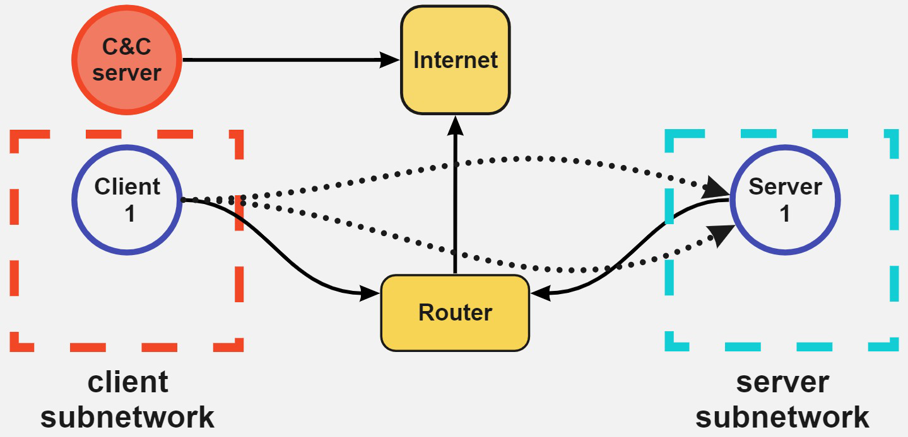

# NetSecGame
[](https://github.com/stratosphereips/game-states-maker/actions/workflows/python-checks.yml)
[](https://github.com/stratosphereips/game-states-maker/actions/workflows/autotag.yml)

The NetSecGame (Network Security Game) is a framework of reinceforcement learning environment and agents to train and evalate network security attacks and defenses. It builds a simulated local network using the [CYST](https://pypi.org/project/cyst/) network simulator, adds many conditions on the environment and can train reinforcement learning (RL) algorithms on how to better attack and defend the network.


## Install and Dependencies
To run this code you need an environment and access to cyst code. However, the venv needs to be created for your own user

- If you don't have your environment

```bash
python -m venv ai-dojo-venv-<yourusername>
```

- The environment can be activated with

```bash
source ai-dojo-venv<yourusername>/bin/activate
```

- Install the requirements with 

```bash
python3 -m pip install -r requirements.txt
```

- If you use conda use
```bash
conda create --name aidojo python==3.10
conda activate aidojo
python3 -m pip install -r requirements.txt
```

## Architecture
The architecture of the environment can be seen [here](Architecture.md).

## Components of the NetSecGame Environment
The NetSecGame environment has several components in the following files:

- File `env/network_security_game.py` implements the game environment
- File `env/game_components.py` implements a library with objects used in the environment. See [detailed explanation](docs/Components.md) of the game components.
- File `utils/utils.py` is a collection of utils function which the agents can use
- Files in the `env/scenarios` folder, such as `env/scenarios/scenario_configuration.py`. Implements the network game's configuration of hosts, data, services, and connections. It is taken from CYST.
- Files such as `agent/q_learning/q_agent.py` that implement the RL agents.

The [scenarios](#definition-of-the-network-topology) define the **topology** of a network (number of hosts, connections, networks, services, data, users, firewall rules, etc.) while the [task-configuration](#task-configuration) is to be used for definition of the exact task for the agent in one of the scenarios (with fix topology).

### Assumptions of the NetSecGame
1. We work with the closed-world assumption. Only the defined entities exist in the simulation.
2. No actions have a "delete" effect (the attacker does not give up ownership of nodes, does not forget nodes or services, and when data is transferred we assume it's copied and therefore present in both nodes).
3. If the attacker does a successful action in the same step that the defender successfully detects the action, the priority goes to the defender. The reward is a penalty, and the game ends.

## Actions
There are currently implemented five types of actions:
| Action name          | Description                                                              | Parameters                         | Effects                                          |
|----------------------|--------------------------------------------------------------------------|---------------------------------------|--------------------------------------------------|
| Scan Network          | Scans the given network for active hosts | network, mask                        | extends 'known_hosts'                            |
| Find Services         | Scans given host for running services                                    | target IP                               | extends 'known_services' with host:service pairs |
| Exploit Service | Runs exploit in service to gain control                                  | target IP, target service                     | extends 'controlled_hosts'                       |
| Find Data            | Runs code to discover data either in a given service or in a controlled host | target IP, target service | extends 'known_data' with host:data pairs        |
| Exfiltrate data      | Runds code to move data from host to host                                | source IP, data, target IP  | extends 'known_data with "target:data" pair      |

### Assumption and Conditions for Actions
1. When playing the `ExploitService` action, it is expected that the agent has discovered this service before (by playing `FindServices` in the `target_host` before this action)
2. The `Find Data` action finds all the available data in the host if successful.
3. The `Find Data` action requires ownership of the target host.
4. Playing `ExfiltrateData` requires controlling **BOTH** source and target hosts
5. Playing `Find Services` can be used to discover hosts (if those have any active services)
6. Parameters of `ScanNetwork` and `FindServices` can be chosen arbitrarily (they don't have to be listed in `known_newtworks`/`known_hosts`)

### Actions for the defender
In this version of the environment, the defender does not have actions, and it is not an agent. It is an omnipresent entity in the network that can detect actions from the attacker. This follows the logic that in real computer networks, the admins have tools that consume logs from all computers simultaneously, and they can detect actions from a central position (such as a SIEM). There are several modes of the defender (see [Task Configuration - Defender](#defender-configuration) for details.


## State of the game
States in the game are represented as collections of assets of the agents. Actions, if successful, extend the assets. Currently, the state representation consists of the follwing parts:
* `known_networks` (set of networks known to the attacker)
* `known_hosts` (set of hosts known to the attacker)
* `controlled_hosts` (set of hosts controlled by the attacker)
* `known_services` (dict of host:service pairs. A service is a port)
* `known_data` (dict of host:path pairs. path is where the data was found)


In every step, the environment provides an Observation. The observation includes:
1. `state` - A GameState object
2. `reward` - float of the immediate reward obtained from the previous step
3. `done` - boolean indicating if the interaction can continue
4. `info` - a dictionary with additional information. Mainly used to determine the cause of the termination of the interaction (`goal_reached`/`detection`/'max_steps'

### Starting the environment
The environment should be created by an agent upon starting. The properties of the environment can be defined in a YAML file.
When created, the environment:
1. reads the configuration file
2. loads the network configuration from the config file
3. reads the defender type from the configuration
4. creates starting position and goal position following the config file

### Interaction with the Environment
Each agent can interact with the environment using the `env.step(action:Action)` method, which returns an Observation with `next_state`, `reward`, `is_terminal`, `done`, and `info` values. Once the terminal state or timeout is reached, no more interaction is possible until `env.reset()`.

### Restarting the environment
`env.reset()` can be used for resetting the environment to the original state. That is to the state after `env.initialize()` was called. In other words, `env.current_state` is replaced with `attacker_start_position`, and `step_counter` is set to zero.
The environment is also reset after initialization.


## Task configuration
The task configuration is a YAML file that is used for the exact definition of the task an agent should be solving. there are two main parts of the configuration
### Environment configuration
The environment part defines the properties of the environment for the task (see the example below). In particular:
- `random_seed` - sets seed s for any random process in the environment
- `scenario` - sets the scenario (network topology) used in the task (currently, `scenario1_tiny`, `scenario1_small`, and `scenario1` are available)
- `max_steps` - sets the maximum number of steps an agent can make before an episode is terminated
- `store_replay_buffer` - if `True`, interaction of the agents is serialized and stored in a file
- `use_dynamic_addresses` - if `True`, the network and IP addresses defined in `scenario` are randomly changed at the beginning of **EVERY** episode (the network topology is kept as defined in the `scenario`. Relations between networks are kept, IPs inside networks are chosen at random based on the network IP and mask)
```YAML
env:
  random_seed: 42
  scenario: 'scenario1'
  max_steps: 15
  store_replay_buffer: True
  use_dynamic_addresses: False
  actions:
    scan_network:
      prob_success: 0.9
      prob_detection: 1
    find_services:
      prob_success: 0.9
      prob_detection: 1
    exploit_services:
      prob_success: 0.7
      prob_detection: 1
    find_data:
      prob_success: 0.8
      prob_detection: 1
    exfiltrate_data:
      prob_success: 0.8
      prob_detection: 1
```
### Agent configuration
Configuration of the agents in the task. It consits of the *Attacker* and  *Defender*. 

- `random_seed` - sets seed s for any random process in the agents

```YAML
agents:
  random_seed: 42
```
#### Attacker configuration
Definition of attacking agent's properties:
- `goal` Section defines the winning conditons for the attacker in each part: `known_networks:`(set), `known_hosts`(set), `controlled_hosts`(set), `known_services`(dict), `known_data`(dict). Each of the part can be empty (not part of the goal, exactly defined (e.g. `known_networks: [192.168.1.0/24, 192.168.3.0/24]`) or include keyword `random` (`controlled_hosts: [213.47.23.195, random]`, `known_data: {213.47.23.195: [random]}`.
- `start_position` Definiton of starting position (initial state) of the attacker. It consits of `known_networks:`(set), `known_hosts`(set), `controlled_hosts`(set), `known_services`(dict), `known_data`(dict). Each of the part can be empty (not part of the goal, exactly defined (e.g. `known_networks: [192.168.1.0/24, 192.168.3.0/24]`) or include keyword `random` (`controlled_hosts: [213.47.23.195, random]`, `known_data: {213.47.23.195: [random]}`. The initial network configuration must assign at least **one** controlled host to the attacker in the network. Any item in `controlled_hosts` is copied to `known_hosts` so there is no need to include these in both sets. `known_networks` is also extended with a set of **all** networks accessible from the `controlled_hosts`
- `randomize_goal_every_episode` - if `True`, each keyword `random` is replaced with a randomly selected, valid option at the beginning of **EVERY** episode. If set to `False`, randomization is performed only *once* when the environment is initialized.
```YAML
agents:
  attacker:
    goal:
      randomize_goal_every_episode: False
      #known_networks: [192.168.1.0/24, 192.168.3.0/24]
      known_hosts: []
      controlled_hosts: []
      known_services: {192.168.1.3: [Local system, lanman server, 10.0.19041, False], 192.168.1.4: [Other system, SMB server, 21.2.39421, False]}
      known_data: {213.47.23.195: ["random"]}

    start_position:
      known_networks: []
      known_hosts: []
      # The attacker must always at least control the CC if the goal is to exfiltrate there
      # Example of fixing the starting point of the agent in a local host
      controlled_hosts: [213.47.23.195, random]
      # Services are defined as a target host where the service must be, and then a description in the form 'name,type,version,is_local'
      known_services: {}
      known_data: {}
```
#### Defender configuration
Definition of defending agent's properties. Currently, the defender is **NOT** a separate agent but it is considered part of the environment.
`type` - Type of the defender. Three types are currently implemented:
  1. `NoDefender` (default) - interation without defender
  2. `StochasticDefender` - detections are based on ActionType probabilities (defined in the task configuraion, section `[env][actions]`).
  3. `StochasticDefenderWithThreshold` - Modification of stochastic defender. Detection probabilities are used *IF* threasholds in the particular ActionType is reached. Thresholds are computed in time windows defined by `tw_size` (`tw_size=5` means that 5 previous actions are taken into account). If ratio of some ActionType within the timewindow is above the threshold, the probability defined in the task configuraion, section `[env][actions]` is used to determine if the action was detected. For action *BELOW* the thresholds, no detection is made. Additionally, thresholds for consecutive action type is defined in `consecutive_actions`. For example with
```YAML
  scan_network:
    consecutive_actions: 2
```
if the agent uses action ScanNetwork (regardless of the parameters) twice or more, the detection can occur. Action types `FindData` and `exploit_service` have additional thresholds for repeated actions (with parameters) throughout the **WHOLE** episode (e.g. if action `<ActionType.FindData|{'target_host': 192.168.2.2}>` is played more than 2 with following configuration, the detection can happen based on the defined probability).  
```YAML
agents:
  defender:
    type: 'StochasticWithThreshold'
    tw_size: 5
    thresholds:
      scan_network:
        consecutive_actions: 2
        tw_ratio: 0.25
      find_services:
        consecutive_actions: 3
        tw_ratio: 0.3
      exploit_service:
        repeated_actions_episode: 2
        tw_ratio: 0.25
      find_data:
        tw_ratio: 0.5
        repeated_actions_episode: 2
      exfiltrate_data:
        consecutive_actions: 2
        tw_ratio: 0.25
```

## Definition of the network topology
The network topology and rules are defined using a [CYST](https://pypi.org/project/cyst/) simulator configuration. Cyst defines a complex network configuration, and this environment does not use all Cyst features for now. CYST components currently used are:

- Server hosts (are a NodeConf in CYST)
    - Interfaces, each with one IP address
    - Users that can login to the host
    - Active and passive services
    - Data in the server
    - To which network is connected
- Client host (are a Node in CYST)
    - Interfaces, each with one IP address
    - To which network is connected
    - Active and passive services if any
    - Data in the client
- Router (are a RouterConf in CYST)
    - Interfaces, each with one IP address
    - Networks
    - Allowed connections between hosts
- Internet host (as an external router) (are a Node in RouterConf)
    - Interfaces, each with one IP address
    - Which host can connect
- Exploits
    - which service is the exploit linked to

Very important is that we made an addition to the NodeConfig objects in our Cyst configuration to include the property 'note' with the text 'can_start_attacker'. Meaning that the game env will take these hosts as candidates for the random start position.

### Scenarios
In the current state, we support a single scenario: Data exfiltration to a remote C&C server.

#### Data exfiltration to a remote C&C
For the data exfiltration we support 3 variants. The full scenario contains 5 clients (where the attacker can start) and 5 servers where the data which is supposed to be exfiltrated can be located. *scenario1_small* is a variant with a single client (attacker always starts there) and all 5 servers. *scenario1_tiny* contains only single server with data. The tiny scenario is trivial and intended only for debuggin purposes.
<table>
  <tr><th>Scenario 1</th><th>Scenario 1 - small</th><th>Scenario 1 -tiny</th></tr>
  <tr><td></td><td><td></td></tr>
</table>

## Agents Implemented
Currently, the implemented agents are:

- Q learning agent in `agents/q_learning/`
- Double Q learning agent in `agents/double_q_learning/`
- Random agent in `agents/random/`
- Interactive agent in `agents/interactive/`
- LLM agent in `agents/llm/`
- LLM QA agent in `agents/llm_qa/`
- GNN Reinforce agent in `agents/gnn_reinforce/`

## Run the agents

The game is played and started by running the different agents.

To run the Q learning agent with default configuration for 100 episodes:

```bash
python agents/q_learning/q_agent.py --episodes 100
```

## Tensorboard logs

The logs for tensorboard are stored for all agents in `agents/tensorboard-logs/`.


## Testing the environment

It is advised after every change you test if the env is running correctly by doing

```bash
tests/run_all_tests.sh
```

This will load and run the unit tests in the `tests` folder.

## Code adaptation for new configurations
The code can be adapted to new configurations of games and for new agents.
