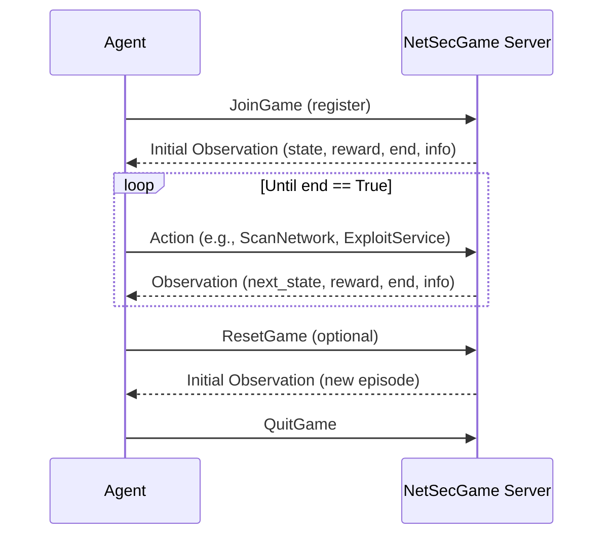

# Getting Started

This guide covers installation, configuration, and running your first NetSecGame session.

## Installation

### Docker (recommended)

The easiest way to run the NetSecGame server is via the official Docker image:

```bash
docker pull stratosphereips/netsecgame
```

#### Building the image locally

```bash
docker build -t netsecgame:local .
```

To build the experimental **Whitebox** variant (agents receive the full action list upon registration):

```bash
docker build --build-arg GAME_MODULE="netsecgame.game.worlds.WhiteBoxNetSecGame" -t netsecgame:local-whitebox .
```

!!! warning
    The Whitebox variant is currently experimental.

### pip install (agent development)

To install the package for developing agents:

```bash
pip install netsecgame
```

To include dependencies for running the game server locally:

```bash
pip install netsecgame[server]
```

### Installing from source

For modifying the environment itself, install in a virtual environment:

=== "Python venv"
    ```bash
    python -m venv <venv-name>
    source <venv-name>/bin/activate
    pip install -e .
    ```

=== "Conda"
    ```bash
    conda create --name aidojo python==3.12
    conda activate aidojo
    pip install -e .
    ```

## Task Configuration

A YAML configuration file defines the task for the NetSecGame. It specifies starting positions, goals, rewards, and environment properties.

### Example Configuration

```yaml
# The objective of the Attacker in this task is to locate specific data
# and exfiltrate it to a remote C&C server.
# The scenario starts AFTER the initial breach of the local network
# (the attacker controls 1 local device + the remote C&C server).

coordinator: 
  agents: 
    Attacker: # Configuration of 'Attacker' agents
      max_steps: 25 # timeout set for the role `Attacker`
      goal: # Definition of the goal state
        description: "Exfiltrate data from Samba server to remote C&C server."
        known_networks: []
        known_hosts: []
        controlled_hosts: []
        known_services: {}
        known_data: {213.47.23.195: [[User1,DataFromServer1]]} # winning condition
        known_blocks: {}
      start_position: # Definition of the starting state
        known_networks: []
        known_hosts: []
        controlled_hosts: [213.47.23.195, random] # 'random' is replaced during init
        known_services: {}
        known_data: {}
        known_blocks: {}

    Defender:
      goal:
        description: "Block all attackers"
        known_networks: []
        known_hosts: []
        controlled_hosts: []
        known_services: {}
        known_data: {}
        known_blocks: {213.47.23.195: 'all_attackers'}

      start_position:
        known_networks: []
        known_hosts: []
        controlled_hosts: []
        known_services: {}
        known_data: {}
        blocked_ips: {}
        known_blocks: {}

env: # Environment configuration
  scenario: 'two_networks_tiny' # use the smallest topology
  use_global_defender: False
  use_dynamic_addresses: False
  use_firewall: True
  save_trajectories: False
  required_players: 1
  rewards:
    success: 100
    step: -1
    fail: -10
    false_positive: -5
```

For a full reference of all configuration options, see the [Configuration Documentation](configuration.md).

## Running the Game Server

### In Docker

```bash
docker run -d --rm --name nsg-server \
  -v $(pwd)/examples/example_task_configuration.yaml:/netsecgame/netsecenv_conf.yaml \
  -v $(pwd)/logs:/netsecgame/logs \
  -p 9000:9000 stratosphereips/netsecgame \
  --debug_level="INFO"
```

| Flag | Description |
|------|-------------|
| `--name nsg-server` | Name of the container |
| `-v <config>:/netsecgame/netsecenv_conf.yaml` | Mount your configuration file |
| `-v $(pwd)/logs:/netsecgame/logs` | Mount logs directory |
| `-p <port>:9000` | Expose the game server port |
| `--debug_level` | Logging level: `DEBUG`, `INFO`, `WARNING`, `CRITICAL` (default: `INFO`) |

#### Running on Windows (Docker Desktop)

```cmd
docker run -d --rm --name nsg-server ^
  -p 9000:9000 ^
  -v "%cd%\examples\example_task_configuration.yaml:/netsecgame/netsecenv_conf.yaml" ^
  -v "%cd%\logs:/netsecgame/logs" ^
  stratosphereips/netsecgame:latest ^
  --debug_level="INFO"
```

### Locally

```bash
python3 -m netsecgame.game.worlds.NetSecGame \
  --task_config=./examples/example_task_configuration.yaml \
  --game_port=9000 \
  --debug_level="INFO"
```

The game server will start on `localhost:9000`.

## Creating Your First Agent

Agents connect to the game server and interact using the standard RL loop: submit an [Action](game_components.md), receive an [Observation](architecture.md#observations).

All agents should extend the [`BaseAgent`](base_agent.md) class:

```python
from netsecgame import BaseAgent, Action, GameState, Observation, AgentRole

class MyAgent(BaseAgent):
    def __init__(self, host, port, role: str):
        super().__init__(host, port, role)

    def choose_action(self, observation: Observation) -> Action:
        # Define your logic here based on observation.state
        pass

def main():
    agent = MyAgent(host="localhost", port=9000, role=AgentRole.Attacker)
    observation = agent.register()

    while not observation.end:
        action = agent.choose_action(observation)
        observation = agent.make_step(action)

    agent.terminate_connection()
```

For full agent implementations, see the [NetSecGameAgents](https://github.com/stratosphereips/NetSecGameAgents) repository.

## Interaction Flow


